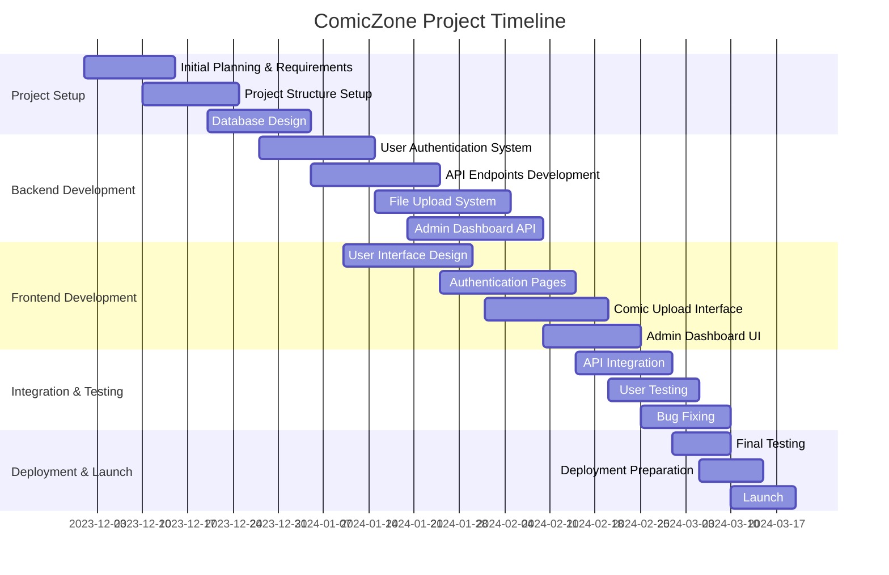

```mermaid
gantt
    title ComicZone Project Timeline
    dateFormat  YYYY-MM-DD
    section Project Setup
    Initial Planning & Requirements     :2023-12-01, 2023-12-15
    Project Structure Setup             :2023-12-10, 2023-12-25
    Database Design                     :2023-12-20, 2024-01-05
    
    section Backend Development
    User Authentication System          :2023-12-28, 2024-01-15
    API Endpoints Development           :2024-01-05, 2024-01-25
    File Upload System                  :2024-01-15, 2024-02-05
    Admin Dashboard API                 :2024-01-20, 2024-02-10
    
    section Frontend Development
    User Interface Design               :2024-01-10, 2024-01-30
    Authentication Pages                :2024-01-25, 2024-02-15
    Comic Upload Interface              :2024-02-01, 2024-02-20
    Admin Dashboard UI                  :2024-02-10, 2024-02-25
    
    section Integration & Testing
    API Integration                     :2024-02-15, 2024-03-01
    User Testing                        :2024-02-20, 2024-03-05
    Bug Fixing                          :2024-02-25, 2024-03-10
    
    section Deployment & Launch
    Final Testing                       :2024-03-01, 2024-03-10
    Deployment Preparation              :2024-03-05, 2024-03-15
    Launch                              :2024-03-10, 2024-03-20
``` 